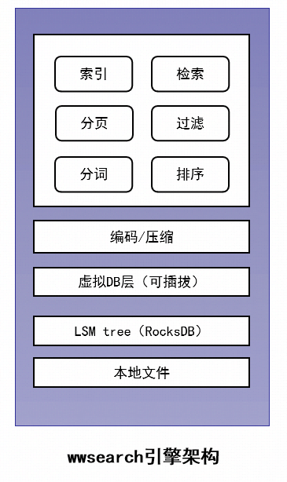

# wwsearch


## 简介

`wwsearch`是企业微信后台自研的全文检索引擎。它为海量用户下的全文快速检索而设计，底层支持可插拔的`lsm tree`存储引擎。目前覆盖企业微信所有在线检索场景：企业员工通讯录、审批、日报、周报、汇报、企业素材检索，也包括企业邮箱的全文邮件检索。 最大业务场景有300+亿条记录，索引词项万亿+，存储容量几十TB，支撑实时在线用户检索。

## 特性

1. **实时数据修改**：数据写入即实时可查。对外提供插入、更新、删除、覆盖写等接口，可适应更新频繁场景，也适应于少改或不改场景。**更新粒度更细，通过基于词级别的更新实现，传统倒排是基于文档的更新。**
2. **支持灵活Query**：支持词的等值、前缀、模糊匹配。多个Query通过And     、Or进行组合，满足不同场景的检索需求。Query还可以按指定field进行检索。
3. **后置过滤**：支持对检索索引后的结果进行二次过滤，支持等值、数值范围、数组元素查找、字符串模糊等过滤特性。适用于如无法建立高区分度索引的字段过滤、带有业务特定场景的过滤。
4. **灵活排序**：支持按多个field的属性值组合排序，类似order by语义。
5. **检索功能可扩展**：场景需要时，可以扩展各类聚合函数（sum/avg…）,也可以支持场景文本打分。

## 使用示例

```c++
// A simple example for index documents and search match terms.
// 参考 example.cpp 
int main() {
  wwsearch::DefaultIndexWrapper indexer;
  bool use_rocksdb = true;
  // use rocksdb
  indexer.DBParams().path.assign("/tmp/db");//数据文件会写到/tmp/db下，需提前创建好
  wwsearch::SearchStatus status = indexer.Open(use_rocksdb);
  // construct field flag 设置字段属性
  wwsearch::IndexFieldFlag flag;
  flag.SetStoredField();
  flag.SetTokenize();
  flag.SetSuffixBuild();
  flag.SetDocValue();
  flag.SetInvertIndex();
  // 构建 documents
  std::vector<wwsearch::DocumentUpdater *> documents;
  // 生成 3 个 document
  for (int i = 0; i < 3; i++) {
    wwsearch::DocumentUpdater *document_updater =
        new wwsearch::DocumentUpdater();
    wwsearch::Document &document = document_updater->New();
    document.SetID(i + 1);  // document id must start from 1.
    // 每个 document 有三个字段
    // 0 -> word
    // 1 -> filter_value
    // 2 -> sort_value
    //Document[1]
    // - field=0, flag=31, type=3, terms_size=0, str_value=one two three
    // - field=1, flag=31, type=1, terms_size=0, value:100
    // - field=2, flag=31, type=1, terms_size=0, value:1000
    {
      auto field = document.AddField();
      field->SetMeta(0, flag);
      field->SetString("one two three");
    }
    {
      auto field = document.AddField();
      field->SetMeta(1, flag);
      field->SetUint32(100 + i);
    }
    {
      auto field = document.AddField();
      field->SetMeta(2, flag);
      field->SetUint32(1000 + i);
    }
    documents.push_back(document_updater);
  }
  // add document 
  // 构建 RocksDB table_id 
  wwsearch::TableID table;
  table.business_type = 1;
  table.partition_set = 10000;
  bool success = indexer.index_writer_->AddDocuments(table, documents);
  // do search
  // 用于构建term查询，两两结合，共4条查询语句
  const char *terms1[] = {"one", "two", "tw", "ne"};
  const char *terms2[] = {"two", "three", "tw", "ne"};
  for (size_t i = 0; i < sizeof(terms1) / sizeof(const char *); i++) {
    wwsearch::Searcher searcher(&indexer.Config());
    std::string term1(terms1[i]);
    std::string term2(terms2[i]);
    wwsearch::AndQuery query;// construct query 
    std::list<wwsearch::DocumentID> match_docids; // 保存命中doc ID
    std::vector<wwsearch::Document *> match_documents;// 保存搜索文档结果
    std::vector<wwsearch::SearchStatus> ss;// 搜索结果状态
    // construct terms query
    // term=two and three
    wwsearch::BooleanQuery query1(0, term1);
    wwsearch::BooleanQuery query2(0, term2);
    query.AddQuery(&query1);
    query.AddQuery(&query2);
    // construct range filter and field filter 
    // filter=field=1 in range [102,103]
    std::vector<wwsearch::Filter *> filter;
    {
      wwsearch::RangeFilter *rule = new wwsearch::RangeFilter(102, 103);
      rule->GetField()->SetMeta(1, flag);
      rule->GetField()->SetUint32(0);
      filter.push_back(rule);
    }
    // construct sorter 
    std::vector<wwsearch::SortCondition *> sorter;
    {
      wwsearch::NumericSortCondition *sort =
          new wwsearch::NumericSortCondition(2, wwsearch::kSortConditionDesc);
      sorter.push_back(sort);
    }
    // do query 
    // match_docids:包含命中文档的ID
    auto status =
        searcher.DoQuery(table, query, 0, 10, &filter, &sorter, match_docids);
    if (status.OK()) {
      // 构建document，赋值ID
      for (auto doc : match_docids) {
        wwsearch::Document *document = new wwsearch::Document;
        document->SetID(doc);
        match_documents.push_back(document);
      }
      // now we fetch document again.
      // 根据ID获取document的内容，成功后document内容将被填满
      auto ret = searcher.GetStoredFields(table, match_documents, ss, nullptr);
 
    }
    for (auto rule : filter) delete rule;
    for (auto sort : sorter) delete sort;
    for (auto d : match_documents) delete d;
  }
  return 0;
}
```

## 代码结构

```shell
wwsearch/
├── AUTHORS
├── benchmark--基准测试，编译完成后为 wwsearch_ben
├── build--编译结果
├── build.sh
├── cmake
├── CMakeLists.txt
├── Contributing.md
├── deps--依赖项：protobuf/rockdb/snappy/tokenizer
├── doc
├── example--示例，包含入库和查询
├── format.sh
├── include--头文件，定义各种接口类声明
├── LICENSE.TXT
├── README-en.md
├── README.md
├── src--实现代码
├── unittest--单元测试
├── wwsearch-logo.png
└── wwsearch_user_help_group.png
```

## 代码模块

### query/score/weight

`and/bool/or/prefix/post` 各个类型的查询，评分，加权的单独实现。

### Codec

`codec*.h` 用于`正排/倒排表/docvalue表`，所有的 key-value 编码/解码。倒排表的`dos_list`支持固定长度的格式和压缩格式。

| table    | key                                                   | value                                                       |
| -------- | ----------------------------------------------------- | ----------------------------------------------------------- |
| 正排     | table_id[bussiness_type, partition_set],document_id   | document  lsmstore pb(only including store flag field)      |
| 倒排     | table_id[bussiness_type, partition_set],field_id,term | doc_id3,doc_id2,doc_id1                                     |
| docvalue | table_id[bussiness_type, partition_set],document_id   | document  lsmstore pb(only including docvalue  flag fields) |

1. 固定长度格式:

- `[header(1B)][doc_id(8B)][doc_state(1B)]...[doc_id(8B)][doc_state(1B)]`
- `doc_id` 是 `uint64_t`
- `doc_state` 是 `uint8_t` 代表 `Add/Delete`

2. 压缩格式：

- `[header(1B)][delete flag block][(doc_id,doc_state) variable length]...[(doc_id,doc_state)     variable length]`
- 同时使用增量压缩。

### Document

`document.h` 提供`document` class，定义`document`的元数据和fields信息

`document_writer.h` 定义对`document`的操作方法。

### Index

`index_writer.h`提供索引文档的接口。

- 输入：`std::vector<DocumentUpdater*>`，`DocumentUpdater`中包含要索引的文档
- 输出：`success/fail`

整个索引流程如下：

1. 检查`DocumentUpdater`中新文档的ID在DB中的状态
2. 如果存在，和旧的doc合并
3. 创建正排表的 KV
4. 创建倒排表的 KV
5. 创建 `docvalue` 表的 KV
6. Flush 到 DB 中

主要涉及6个接口，分别是：

1. `AddDocuments`：仅当文档id不存在时添加；
2. `UpdateDocuments`：仅当文档id存在时更新；更新时会保留旧文档存在的未更新field内容；
3. `AddOrUpdateDocuments`：若文档id不存在则添加，若存在则更新；
4. `ReplaceDocuments`：仅当文档id存在时替换；
5. `DeleteDocuments`：仅当文档id存在时删除；
6. `AddDocumentsWithoutRead`：文档id不存在则添加，存在则覆盖；

下面以用户常用的`AddOrUpdateDocuments`为例说明用法。

```c++
// wwsearch/index_writer.h
bool AddOrUpdateDocuments(const TableID &table,
                          std::vector<DocumentUpdater *> &documents,
                          std::string *store_buffer = nullptr,
                          SearchTracer *tracer = nullptr);
// wwsearch/document.h
class DocumentUpdater {
    ...
  Document new_document_;
    ...
};
class Document {
    ... 
  std::vector<IndexField *> fields_;
  DocumentID document_id_;
    ...
};
// wwsearch/index_field.h
class IndexField {
    ...
  FieldID field_id_;
  IndexFieldFlag field_flag_;
  kIndexFieldType field_type_;
  uint64_t numeric_value_;
  std::string string_value_;
    ...
}
```

用户使用涉及主要字段说明:

1. TableID : `bussiness_type(uint8_t)+partition_set(uint64_t)`组成，分表；

2. DocumentID :     `uint64_t`，文档id，文档的唯一标识；

3. IndexField ：     文档列的信息，包括列属性和值。

4. - `field_id_`，field的ID

   - `field_flag_`，索引标记

   - - `kTokenizeFieldFlag`，是否分词
     - `kStoreFieldFlag`，是否存储原始数据
     - `kDocValueFieldFlag`，是否存储列值属性
     - `kSuffixBuildFlag`，是否后缀展开
     - `kInvertIndexFieldFlag`，是否建立倒排索引

   -  `field_type_`，值类型

   - - `kUint32IndexField`
     - `kUint64IndexField` 
     - `kStringIndexField` 

   - `numeric_value`_/ `string_value`_，字段原始值

### Search

`searcher.h` 用户查询的接口

- 输入：`Query, Filters, Sorters`
- 输出：`doc list`

查询流程如下：

1. 通过`Query`构建`Scorer`，调用`Weight`(从db读取/遍历倒排表中数据)。
2. 构建`Collector`来收集所有doc     id。
3. 用`Filters`过滤doc id列表。
4. 对文档ID列表进行排序。
5. 返回结果

主要涉及接口：

```
// wwsearch/searcher.h
SearchStatus DoQuery(const TableID &table, Query &query, size_t top,
                     std::vector<Filter *> *filter,
                     std::vector<SortCondition *> *sorter,
                     std::list<DocumentID> &docs,
                     uint32_t min_match_filter_num = 0)
```

用户使用涉及主要字段说明：

1. `TableID` : `bussiness_type(uint8_t) + partition_set(uint64_t)`组成，分表；
2. `Query` ：构建查询的字段信息，可支持`AndQuery`和`OrQuery`的嵌套格式，支持`PrefixQuery`前缀查询；
3. `Filter`：过滤器，支持数字/字符串/数组/多字符串条件过滤；
4. `SortCondition`：对查询得到的文档输出做排序，支持指定field做排序，目前只支持指定数字的field排序；
5. `min_match_filter_num`设置最小匹配的filter数，只要匹配的filter大于此数的文档才能输出。

### Virtual DB

`virtual*.h` 虚拟DB层相关，将数据持久化到virtual db中。目前默认是RocksDB。

### Tokenizer

`tokenizer*.h` 对doc进行分词，构建terms，还有一些小写转换及停用词过滤等功能。

### 代码编译

### 依赖模块

```shell
# wwsearch/deps/ 
protobuf-2.4.1
snappy-1.0.4
rocksdb-v5.16.6
tokenizer-mmseg
```

### CentOS7

```shell
#1.升级cmake
wget https://cmake.org/files/v3.9/cmake-3.9.2.tar.gz
tar -xvf cmake-3.9.2.tar.gz
cd cmake-3.9.2
./configure
sudo make && make install

#2.安装libtool
sudo yum -y install libtool

#3.安装gflags
git clone https://github.com/gflags/gflags.git
cd gflags
mkdir build && cd build
cmake .. -DGFLAGS_NAMESPACE=google -DCMAKE_CXX_FLAGS=-fPIC ..make -j4
sudo make install

#4.安装glog
git clone https://github.com/google/glog
cd glog
./autogen.sh
./configure CPPFLAGS="-I/usr/local/include -fPIC" LDFLAGS="-L/usr/local/lib"make -j8
sudo make install

#5.安装依赖包
# 安装gcc
yum install gcc gcc-c++  
# 安装boost
yum install boost boost-devel boost-doc
# 安装glog 以及其他依赖包
yum install glog glog-devel kyotocabinet kyotocabinet-devel marisa-devel opencc-devel yaml-cpp yaml-cpp-devel gtest gtest-devel
# ibus-rime还需要什么
yum install libnotify zlib zlib-devel gflags gflags-devel

#6.编译代码
mkdir build
cd build
cmake  ..
make -j1 # 官方默认线程32，太高编译失败，改为1
cp ../deps/tokenizer/etc/wwsearch_* .
```

### Debian9（失败）

```shell
#1.依赖环境准备
apt-get update && apt-get install -y cmake g++ wget autoconf automake libtool pkg-config libleveldb-dev libstemmer-dev libicu-dev build-essential zip libsnappy-dev zlib1g-dev libbz2-dev libgflags-dev && \
    apt-get clean && rm -rf /var/lib/apt/lists/
```

### 编译结果

```shell
build
├── build_version.cc
├── CMakeCache.txt
├── CMakeFiles
├── cmake_install.cmake
├── deps
├── libwwsearch.a
├── Makefile
├── wwsearch_ben--基准测试
├── wwsearch_example--简单示例，包括index和query。
├── wwsearch_mmseg.ini
├── wwsearch_mmseg_uni.lib
└── wwsearch_ut--单元测试

# run example by using mock(simple memory) db
./wwsearch_example
# run example by using rocksdb
mkdir /tmp/db
./wwsearch_example /tmp/db
# run ut
./wwsearch_ut
```

## 内部实现



1. **高效索引更新**：适合审批业务场景，数据流转过程需要多次更新。更细粒度词级别更新实现。

2. **支持亿级分表**：适合多用户场景，避免全量数据搜索过滤。数据表key增加定长的prefix来实现。

3. **全文模糊匹配**：词按后缀展开+索引按词典排序+前缀匹配检索

4. **高效过滤排列**：根据行存和列存的特点，将部分属性混合存储。读取次数少，降低IO

5. **索引压缩**：

   - 支持覆盖写功能：针对只写不改的场景，邮件，单据等

6. - 支持倒排索引压缩：根据codec编码，头部（Header）、倒排列表（DocIDList）、删除列表（DeleteList）压缩存储

7. - 支持主键映射：将业务字符串主键映射为统一的64位无符号整数主键，从0开始递增，方便应用倒排列表的压缩方案。

详细内容可以参考官方介绍：https://github.com/Tencent/wwsearch/blob/master/doc/wwsearch-implement.md

 

**参考链接：**

1. https://blog.csdn.net/suibianshen2012/article/details/81504577
2. https://my.oschina.net/u/169565/blog/3145404
3. https://github.com/Tencent/wwsearch
4. https://github.com/Tencent/wwsearch/blob/master/doc/wwsearch-implement.md
5. https://javadoc.io/doc/org.apache.lucene/lucene-core/latest/index.html